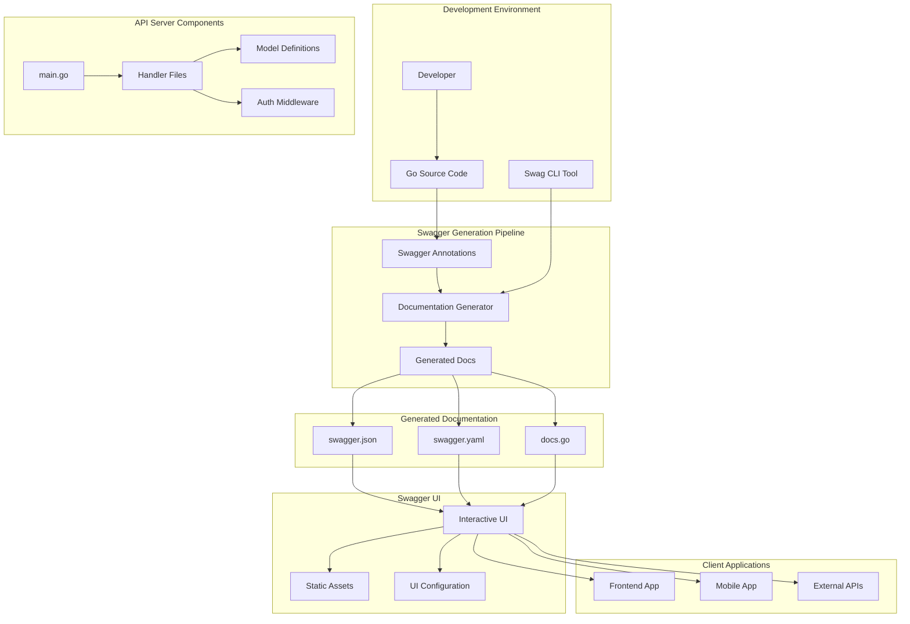
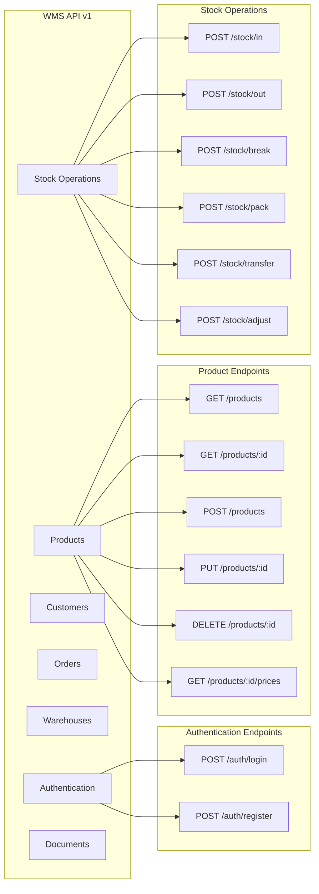
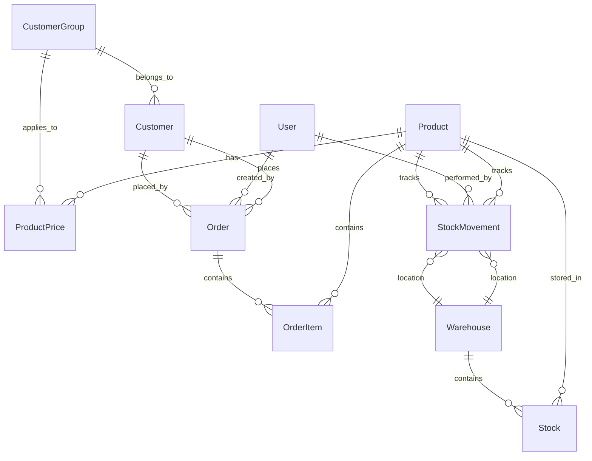
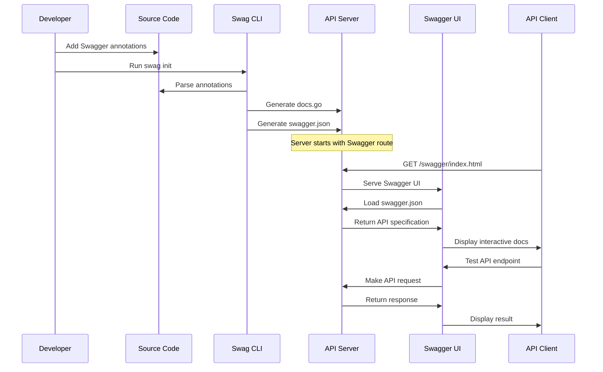
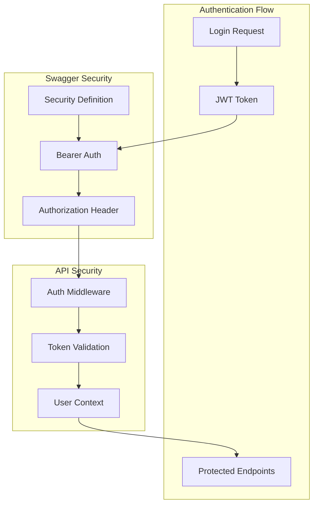
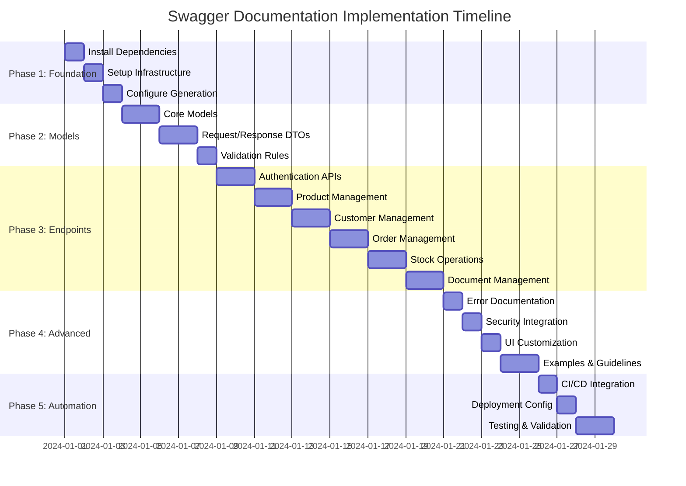

# WMS API Swagger Documentation Architecture

## System Architecture Overview



## API Documentation Structure



## Data Model Relationships



## Swagger Implementation Flow



## Security Architecture



## File Structure and Organization

```
backend/
├── cmd/server/
│   └── main.go                 # Main Swagger config
├── docs/                       # Generated documentation
│   ├── docs.go                # Generated Go code
│   ├── swagger.json           # OpenAPI JSON spec
│   └── swagger.yaml           # OpenAPI YAML spec
├── internal/
│   ├── handlers/              # API handlers with annotations
│   │   ├── auth_handler.go    # @Tags auth
│   │   ├── product_handler.go # @Tags products
│   │   ├── customer_handler.go# @Tags customers
│   │   ├── order_handler.go   # @Tags orders
│   │   ├── stock_handler.go   # @Tags stock
│   │   └── ...
│   ├── models/                # Data models with examples
│   │   └── models.go          # @Description annotations
│   └── middleware/
│       └── auth.go            # Security middleware
├── scripts/
│   ├── generate-docs.sh       # Documentation generation
│   └── serve-docs.sh          # Development server
└── swagger/                   # Custom Swagger assets
    ├── custom.css             # UI customization
    └── logo.png               # Branding assets
```

## Implementation Phases Visualization



## Quality Assurance Checklist

### Documentation Completeness
- [ ] All endpoints documented with proper HTTP methods
- [ ] Request/response schemas defined for all endpoints
- [ ] Authentication requirements specified
- [ ] Error responses documented with status codes
- [ ] Examples provided for complex request/response structures

### Technical Implementation
- [ ] Swagger annotations follow OpenAPI 3.0 specification
- [ ] Generated documentation validates without errors
- [ ] Interactive UI functions correctly with live API
- [ ] Security schemes work with JWT authentication
- [ ] Custom styling and branding applied

### Developer Experience
- [ ] Clear, descriptive endpoint summaries
- [ ] Comprehensive parameter descriptions
- [ ] Realistic example values provided
- [ ] Error scenarios well documented
- [ ] API usage guidelines included

This architecture provides a comprehensive foundation for implementing robust Swagger documentation that will serve as both developer reference and interactive testing environment for the WMS API.